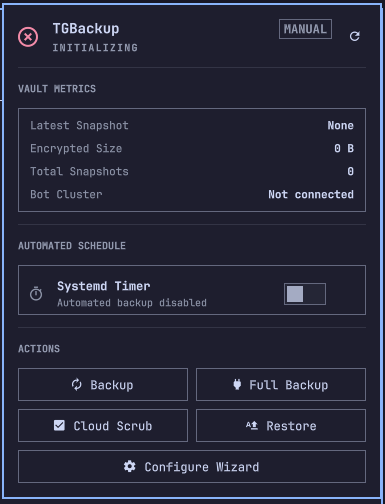

# TGBackup - Native Linux Cloud Backup to Telegram Supergroup Cluster

**TGBackup** is a standalone, native Linux application engineered to perform encrypted, compressed backups of directories, configuration files, and system snapshots directly to a **Telegram Supergroup**. It utilizes a **multi-bot Telegram cluster** in true parallel concurrency (asynchronous worker pools) to maximize upload throughput while enforcing rate-limiting controls.

Unlike solutions relying on Duplicati, Rclone wrappers, or heavy Docker containers, `tgbackup` is a lightweight, native Python application seamlessly integrated with Systemd user units, Btrfs/ZFS atomic snapshots, and the Omarchy desktop shell.

---

## Key Features

- **Zero-Knowledge Security (AES-256-GCM + PBKDF2)**:
  All files and metadata are compressed and encrypted locally before leaving the machine. Chunks uploaded to Telegram contain authenticated ciphertext (AES-GCM tag verification). No plaintext data or filenames are ever transmitted.
- **High-Performance Compression (Zstandard)**:
  Streaming compression powered by Facebook's `zstd` algorithm with configurable compression levels (1 to 19).
- **Smart Incremental Backup & Tombstone Pruning**:
  File changes are tracked using modified timestamps (`mtime`) and file sizes. Unchanged snapshots upload 0 bytes. During layered restores, tombstone tracking automatically removes files that were deleted in subsequent snapshots.
- **Safe 19 MB Chunking & Self-Hosted Bot API Support**:
  Default chunk size is calibrated to 19 MB to strictly comply with Telegram Bot API's 20 MB `getFile` download ceiling. Support for custom self-hosted Bot API servers (`api_endpoint`) allows chunk sizes up to 2 GB.
- **Concurrent Multi-Bot Upload Cluster & Rate Limiting**:
  Asynchronous queue (`asyncio.Queue`) distributes chunk uploads across a pool of bot tokens. Request pacing (`rate_limit_per_minute`) prevents HTTP 429 FloodWait errors.
- **Configurable Staging & Secondary Local Mirroring**:
  Avoids Linux `/tmp` (`tmpfs`) RAM exhaustion by utilizing a configurable physical disk staging directory (`staging_dir`). Seamlessly synchronizes chunks and manifests to a secondary local drive or external HDD (`local_backup_dir` / `--local-dir`).
- **Atomic Concurrency Locking**:
  Inter-process file locking via `fcntl.flock` (`/run/user/<uid>/tgbackup.lock`) guarantees that overlapping cron triggers, systemd timers, or manual CLI invocations terminate gracefully without corrupting database or storage states.
- **Atomic Filesystem Snapshots (Btrfs / ZFS)**:
  Automatic filesystem detection via `findmnt`. If the target directory resides on a Btrfs subvolume, a temporary atomic read-only snapshot is created to ensure consistency even with open files.
- **Zero-Argument Disaster Recovery (`tgbackup reindex`)**:
  Every backup pins an encrypted master catalog (`vault_master_catalog.json.enc`) in the Telegram notifications topic. In the event of complete local disk loss, `tgbackup reindex` automatically queries the pinned catalog and rebuilds the local database without manual message ID entry.
- **Cloud Scrub & Integrity Verification (`tgbackup check`)**:
  Non-destructive diagnostic scan that verifies remote chunk persistence on Telegram servers, alerting about missing or deleted messages.
- **Forum Topics Organization**:
  Automatic topic provisioning per profile (e.g., `Documents_Backup`, `System_Backup`) and a dedicated `Notifications` topic.
- **Desktop & HTML Notifications**:
  Native Linux desktop notifications (`notify-send` / D-Bus) and rich HTML Telegram summaries showing saved bytes, compression ratio, elapsed time, and chunk manifests.
- **GFS Retention Policy**:
  Automated Grandfather-Father-Son rotation (`keep_daily`, `keep_weekly`, `keep_monthly`), with dependency protection for base chunks required by incremental snapshots.
- **Systemd User Timer Automation**:
  Integrated commands to enable, disable, and query automated background timers (`tgbackup schedule enable --cron daily`).
- **Omarchy Shell Plugin**:
  Native Omarchy desktop plugin featuring real-time health diagnostics, manual backup triggers, schedule controls, snapshot browser, and configuration management.

---

## Installation

### 1. System Requirements
- Linux distribution (Arch Linux recommended).
- Python `>= 3.10`
- `tar`, `zstandard`, `openssl`, `findmnt`

### 2. Local Installation / Virtualenv
```bash
git clone https://github.com/tgbackup/tgbackup.git
cd tgbackup
python -m venv .venv
source .venv/bin/activate
pip install -e .
```

### 3. Native Arch Linux Installation (PKGBUILD)
```bash
cd tgbackup
makepkg -si
```

---

## CLI Usage Guide

### 1. Interactive Setup Wizard
Guides through supergroup ID, bot tokens, encryption passphrase, chunk size, staging directory, local mirror path, and retention policy:
```bash
tgbackup init
```

### 2. Backup (Incremental or Full)
```bash
# Run incremental backup for a specific profile
tgbackup backup documents

# Force a full backup regardless of previous incremental state
tgbackup backup documents --full

# Mirror chunks and manifest to an external drive / local path
tgbackup backup documents --local-dir /mnt/backup_hdd

# Execute all configured backup profiles
tgbackup backup --all
```

### 3. List Snapshots & Chain Types
Display snapshot types (`Full`, `Incr`), compressed size, timestamps, and chunk counts:
```bash
tgbackup list
```

### 4. Restore (Layered Incremental with Tombstone Pruning)
Downloads all chunks in the chain (base + incrementals), verifies SHA-256 integrity hashes, applies tombstones, and reconstructs the exact file tree:
```bash
tgbackup restore 20260911_112226 ~/Restore
```

### 5. Cloud Scrub (Integrity Check on Telegram)
Verifies that all remote chunks exist in Telegram:
```bash
tgbackup check
```

### 6. Disaster Recovery (Reindex from Telegram)
Rebuild the local database from a clean machine:
```bash
# Automatic: queries Telegram channel for pinned master catalog
tgbackup reindex

# Explicit: rebuild using a specific Telegram message ID
tgbackup reindex --message-id 2083849
```

### 7. Automated Scheduling with Systemd
```bash
# Enable daily automated backup timer
tgbackup schedule enable --cron daily

# Query timer status
tgbackup schedule status

# Disable background timer
tgbackup schedule disable
```

### 8. Cluster Health & Status
```bash
# Human-readable diagnostic output
tgbackup status

# JSON formatted status for script integration
tgbackup status --json
```

## Omarchy Shell Plugin

<p align="center">
  
</p>

A native desktop plugin for the Omarchy Shell is located in `omarchy-plugin/`:
- **Real-Time Diagnostics**: Live monitoring of Telegram bot cluster status, online bot count, and Vault snapshot metrics.
- **Background Schedule Control**: 1-click toggling of systemd backup timers with active status indicators.
- **Quick Backup & Restore**: Trigger immediate profile backups or browse previous snapshots directly from the desktop bar.
- **Direct Configuration**: Open and edit configuration files directly within the desktop panel.

### Plugin Installation
Link or copy `omarchy-plugin` into your Omarchy plugins directory:
```bash
mkdir -p ~/.config/omarchy/plugins
ln -s "$(pwd)/omarchy-plugin" ~/.config/omarchy/plugins/tgbackup
```
